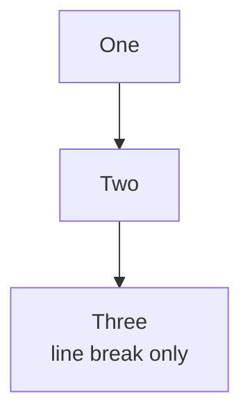
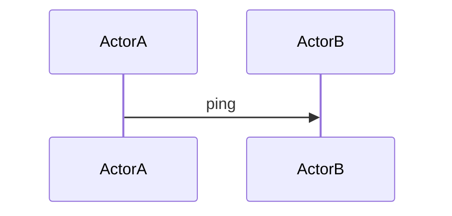
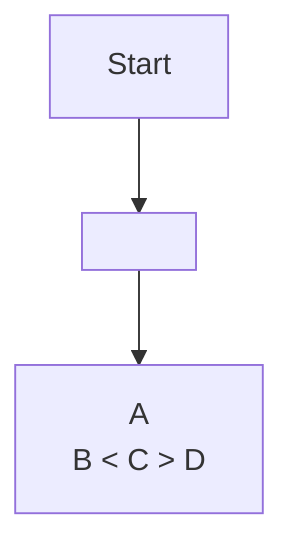
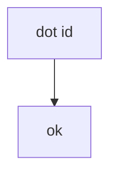
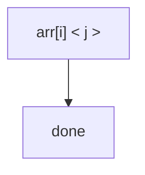
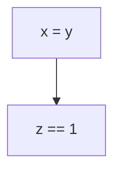
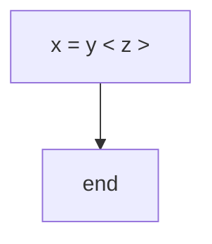
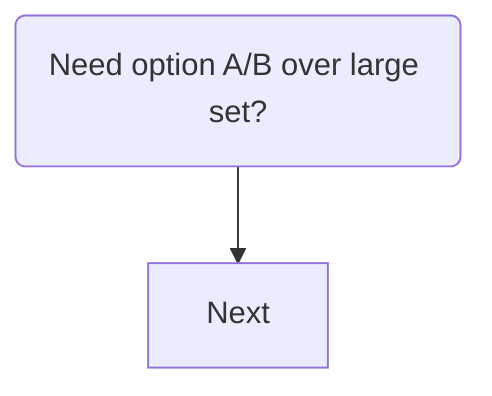

### Case: BR with parenthesis continuation
```json
{
  "expectation": "patched",
  "variant": "normal",
  "mustContain": [
    "C[\"Output label<br/>(follow-up note)\"]"
  ]
}
```
```mermaid
flowchart LR
  A[Start] --> B[Stage one]
  B --> C[Output label<br/>(follow-up note)]
  C --> D[End]
```

### Case: Compact flow
```json
{
  "expectation": "patched",
  "variant": "normal",
  "mustContain": [
    "C[\"Result<br/>(needs retry patch)\"]"
  ]
}
```
```mermaid
flowchart LR
  A[Load] --> B[Work]
  B --> C[Result<br/>(needs retry patch)]
```

### Case: Complex multi-step flow
```json
{
  "expectation": "patched",
  "variant": "normal",
  "mustContain": [
    "N4[\"Step B (mode 1)<br/>secondary note\"]",
    "N5[\"Step C<br/>(mode 2 detail)\"]",
    "N6[\"Step D (mode 3)\"]",
    "N3[\"Step A<br/>plain second line\"]"
  ]
}
```
```mermaid
flowchart LR
  subgraph G1["Group one"]
    N1[Item alpha] --> N2[Item beta]
    N2 --> N3[Step A<br/>plain second line]
  end

  subgraph G2["Group two"]
    N3 --> N4[Step B (mode 1)<br/>secondary note]
    N4 --> N5[Step C<br/>(mode 2 detail)]
    N5 --> N6[Step D (mode 3)]
  end

  N6 --> N7[Final state]
```

### Case: Newline before parenthesis
```json
{
  "expectation": "patched",
  "variant": "normal",
  "mustContain": [
    "B[\"Line one\n  (line two)\"]"
  ]
}
```
```mermaid
flowchart LR
  A --> B[Line one
  (line two)]
  B --> C[Done]
```

### Case: Newline before parenthesis (CRLF)
```json
{
  "expectation": "patched",
  "variant": "crlf",
  "mustContain": [
    "B[\"Line one\r\n  (line two)\"]"
  ]
}
```
```mermaid
flowchart LR
  A --> B[Line one
  (line two)]
  B --> C[Done]
```

### Case: Regular flowchart (safe)
```json
{
  "expectation": "patched",
  "variant": "normal",
  "mustContain": [
    "A1[One] --> B1[Two]",
    "B1 --> C1[\"Three<br/>line break only\"]"
  ]
}
```


### Case: Sequence diagram (safe)
```json
{
  "expectation": "unchanged",
  "variant": "normal"
}
```


### Case: Graph alias with math pipes
```json
{
  "expectation": "patched",
  "variant": "normal",
  "mustContain": [
    "A[\"Pair x,y\"] --> B[\"Expr: &lt;x,y&gt;\"]",
    "A --> C[\"Bars: ||x||, ||y||\"]",
    "B --> D[\"Ratio: &lt;x,y&gt; / (||x|| ||y||)\"]",
    "A --> E[\"Square: ||x-y||^2\"]"
  ]
}
```
```mermaid
graph TD
  A[Pair x,y] --> B[Expr: <x,y>]
  A --> C[Bars: ||x||, ||y||]
  B --> D[Ratio: <x,y> / (||x|| ||y||)]
  A --> E[Square: ||x-y||^2]
  B --> E
  C --> E
  F[Set x,y to unit] --> G[Expr A == Expr B]
  F --> H[Rank A == Rank B]
  D --> G
  E --> H
```

### Case: Already quoted angle brackets
```json
{
  "expectation": "patched",
  "variant": "normal",
  "mustContain": [
    "B[\"&lt;x, y&gt;\"]",
    "C[\"A<br/>B &lt; C &gt; D\"]"
  ]
}
```


### Case: Node id with dot and angle brackets
```json
{
  "expectation": "patched",
  "variant": "normal",
  "mustContain": [
    "node.v1[\"dot id &lt;x&gt;\"]",
    " --> node2[ok]"
  ]
}
```


### Case: Quoted label containing square bracket and angle brackets
```json
{
  "expectation": "patched",
  "variant": "normal",
  "mustContain": [
    "A[\"arr[i] &lt; j &gt;\"]"
  ]
}
```


### Case: Equals sign in unquoted label
```json
{
  "expectation": "patched",
  "variant": "normal",
  "mustContain": [
    "A[\"x &equals; y\"]",
    "B[\"z &equals;&equals; 1\"]"
  ]
}
```


### Case: Equals sign in quoted label
```json
{
  "expectation": "patched",
  "variant": "normal",
  "mustContain": [
    "A[\"x &equals; y &lt; z &gt;\"]"
  ]
}
```


### Case: Decision node with parentheses and slash
```json
{
  "expectation": "patched",
  "variant": "normal",
  "mustContain": [
    "Q2{\"Choose mode (alpha/beta) for step?\"}",
    "B2[\"Value &equals; pair(û, v̂) + α·tag(i) (+ extras, etc.)\"]"
  ]
}
```
```mermaid
flowchart TD
  S([Choose output mode])
  S --> Q2{Choose mode (alpha/beta) for step?}
  Q2 -- Yes --> B2[Value = pair(û, v̂) + α·tag(i) (+ extras, etc.)]
```

### Case: Rounded node with punctuation
```json
{
  "expectation": "patched",
  "variant": "normal",
  "mustContain": [
    "A(\"Need option A/B over large set?\")"
  ]
}
```


### Case: Circle node keeps double parentheses
```json
{
  "expectation": "patched",
  "variant": "normal",
  "mustContain": [
    "A((\"pair(u, v) / ||u|| ||v||\"))"
  ]
}
```
```mermaid
flowchart TD
  A((pair(u, v) / ||u|| ||v||)) --> B[Next]
```

### Case: Stadium node remains bracket-based
```json
{
  "expectation": "patched",
  "variant": "normal",
  "mustContain": [
    "A([\"Value &equals; pair(u, v)\"])"
  ]
}
```
```mermaid
flowchart TD
  A([Value = pair(u, v)]) --> B[Next]
```
