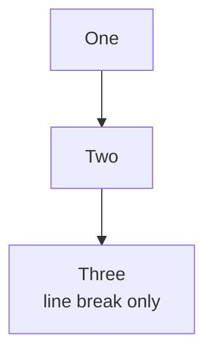
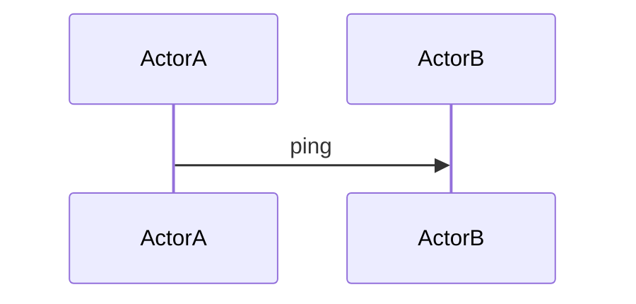

### Case: BR with parenthesis continuation
```json
{
  "expectation": "patched",
  "variant": "normal",
  "mustContain": [
    "C[\"Output label<br/>(follow-up note)\"]"
  ]
}
```
```mermaid
flowchart LR
  A[Start] --> B[Stage one]
  B --> C[Output label<br/>(follow-up note)]
  C --> D[End]
```

### Case: Compact flow
```json
{
  "expectation": "patched",
  "variant": "normal",
  "mustContain": [
    "C[\"Result<br/>(needs retry patch)\"]"
  ]
}
```
```mermaid
flowchart LR
  A[Load] --> B[Work]
  B --> C[Result<br/>(needs retry patch)]
```

### Case: Complex multi-step flow
```json
{
  "expectation": "patched",
  "variant": "normal",
  "mustContain": [
    "N4[\"Step B (mode 1)<br/>secondary note\"]",
    "N5[\"Step C<br/>(mode 2 detail)\"]",
    "N6[\"Step D (mode 3)\"]"
  ],
  "mustNotContain": [
    "N3[\"Step A<br/>plain second line\"]"
  ]
}
```
```mermaid
flowchart LR
  subgraph G1["Group one"]
    N1[Item alpha] --> N2[Item beta]
    N2 --> N3[Step A<br/>plain second line]
  end

  subgraph G2["Group two"]
    N3 --> N4[Step B (mode 1)<br/>secondary note]
    N4 --> N5[Step C<br/>(mode 2 detail)]
    N5 --> N6[Step D (mode 3)]
  end

  N6 --> N7[Final state]
```

### Case: Newline before parenthesis
```json
{
  "expectation": "patched",
  "variant": "normal",
  "mustContain": [
    "B[\"Line one\n  (line two)\"]"
  ]
}
```
```mermaid
flowchart LR
  A --> B[Line one
  (line two)]
  B --> C[Done]
```

### Case: Newline before parenthesis (CRLF)
```json
{
  "expectation": "patched",
  "variant": "crlf",
  "mustContain": [
    "B[\"Line one\r\n  (line two)\"]"
  ]
}
```
```mermaid
flowchart LR
  A --> B[Line one
  (line two)]
  B --> C[Done]
```

### Case: Regular flowchart (safe)
```json
{
  "expectation": "unchanged",
  "variant": "normal"
}
```


### Case: Sequence diagram (safe)
```json
{
  "expectation": "unchanged",
  "variant": "normal"
}
```

